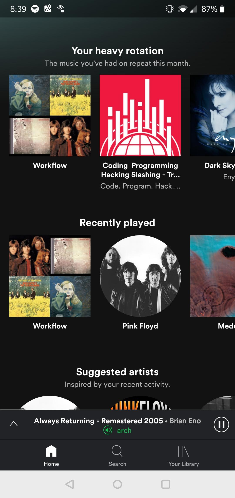
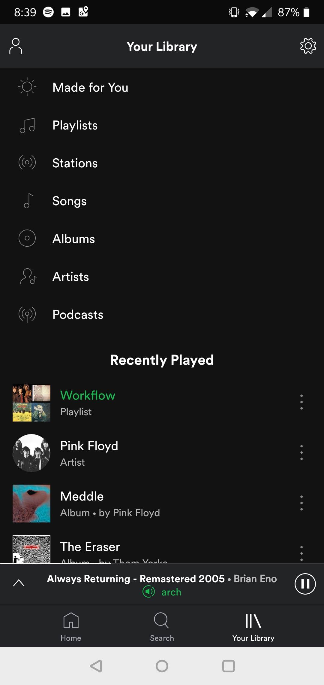
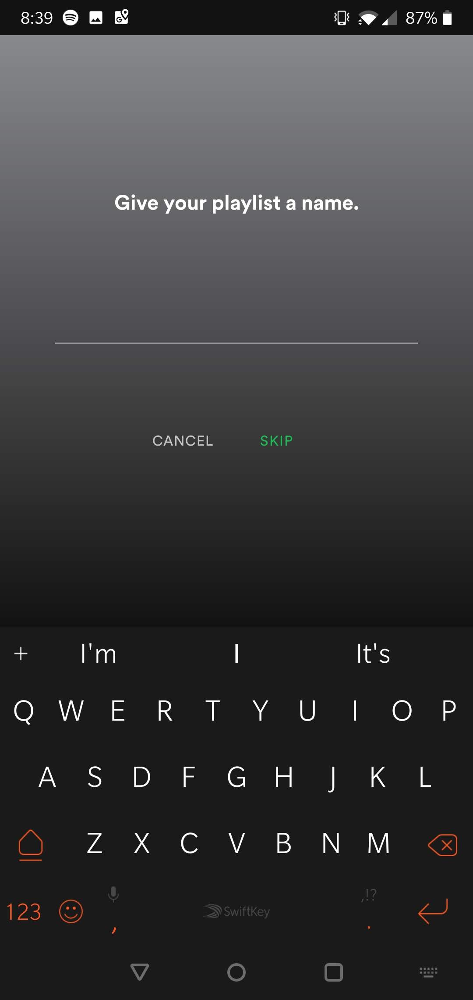
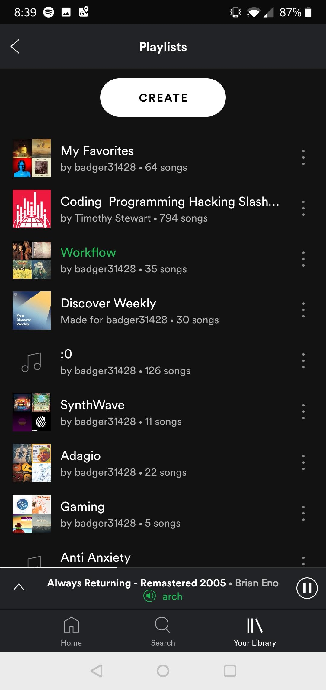
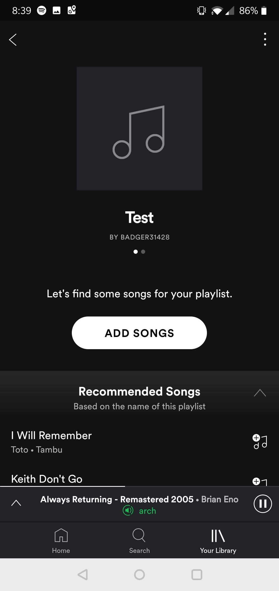
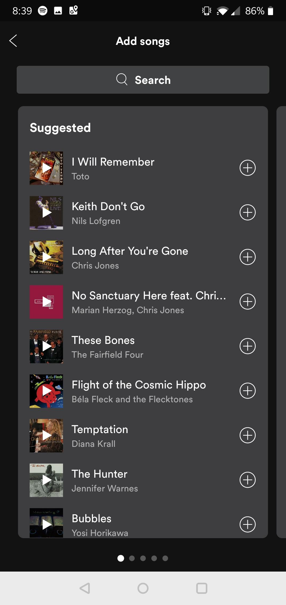

# Practice Questions

## Multiple Choice

1. Which of the following is a reason why usable security is important?
    - A) Users treat security as a secondary task
    - B) Users might compromise security in order to make completion of a task easier
    - C) Users are the strongest link in security
    - D) A and B
    - E) All of the above
1. The barn door property is \_\_\_\_\_\_\_\_\_\_.
    - A) The idea that if an attacker breaches your account, it is too late to stop it
    - B) A usability paradigm that states that an application should be open to all users
    - C) A usability paradigm that states that security should be as easy to use as a barn door
    - D) B and C
    - E) None of the above
1. Which of the following is/are examples of a "something you know" authentication mechanism?
    - A) Fingerprint
    - B) 2FA
    - C) Password
    - D) B and C
    - E) All of the above
1. How would you calculate the base 2 password space of a password scheme where you have to select 4 tiles from an image with 20 tiles in total. (Assume the correct tiles can be selected in **any** order.)
    - A) 2 to the power of log base 2 of 4^20
    - B) 2 to the power of 20 choose 4
    - C) 2 to the power of log base 2 of 4\*20
    - D) 2 to the power of log base 2 of 20!/(20-4)!
    - E) 2 to the power of log base 2 of 20 choose 4
1. What is the usability vs security problem?
    - A) A trade-off between usability and security
    - B) Passwords that are hard to remember are often hard to guess
    - C) Passwords that are easy to remember are often easy to guess
    - D) All of the above
    - E) None of the above
1. Phishing still works because \_\_\_\_\_\_\_\_\_\_.
    - A) People are stupid
    - B) Attackers exploit a lack of awareness of browser security features
    - C) The fishermen work very hard
    - D) A and B
    - E) None of the above
1. Which of the following are ordered from shortest to longest access time?
    - A) Long term memory, sensory memory, working memory
    - B) Sensory memory, working memory, long term memory
    - C) Working memory, sensory memory, long term memory
    - D) Sensory memory, long term memory, working memory
    - E) They all have the same access time
1. In a list, which elements are the most memorable?
    - A) The elements at the beginning of the list
    - B) The elements at the middle of the list
    - C) The elements at the end of the list
    - D) A and B
    - E) A and C
    - F) All of the above
1. What is the Recency Effect?
    - A) The elements at the beginning of the list are more memorable
    - B) The elements at the beginning of the list are less memorable
    - C) The elements at the end of the list are more memorable
    - D) The elements at the end of the list are less memorable
1. People can keep \_\_\_\_\_\_\_\_\_\_.
    - A) 10 things in working memory at a time
    - B) 7 +/- 2 things in sensory memory at a time
    - C) Almost unlimited information in long term memory
    - D) 7 +/- 2 things in working memory at a time
    - E) C and D
1. Which of the following demonstrate best practice in terms of optimizing your UI to work with user memory?
    - A) Only keep 7 or so items in a menu at a time
    - B) Split your menu into 7 groups, but some groups only have 1 item each
    - C) Split your menu into 3 reasonable groups
    - D) Leave your menu the way it was (no grouping)
    - E) None of the above represents a good way to optimize for user memory
1. Which of the following are good rules of thumb for handling user memory?
    - A) Recall over recognition
    - B) Recognition over recall
    - C) Multiple ways of encoding information
    - D) Remember the 7 +/- 2 rule and don't overload user memory
    - E) A, C, and D
    - F) B, C, and D
1. Which of the following **does not represent** good quantitative data to collect in a user study?
    - A) Likert scale questions
    - B) Open-ended questions
    - C) Number of successful attempts per user
    - D) Number of failed attempts per user
    - E) Number of times users got up to use the bathroom
    - F) A, B, and E
    - G) B and E
1. Which of the following would be ordered from lowest to highest value?
    - A) Min, upper quartile, middle quartile, lower quartile, max
    - B) Mean, median, mode
    - C) Min, mean, median, max
    - D) Min, lower quartile, middle quartile, upper quartile, max
    - E) Median, lower quartile, middle quartile, upper quartile, mean
1. A high standard deviation means \_\_\_\_\_\_\_\_\_\_.
    - A) A lot of data will be far from the mean
    - B) A lot of data will be close to the mean
    - C) The median will be much higher than the mean
    - D) The median will be much lower than the mean
    - E) None of the above are related to standard deviation
1. Which of the following a type I error?
    - A) Making a rounding error when calculating mean
    - B) Assuming that causation implies correlation
    - C) Assuming there is a correlation between X and Y when there isn't
    - D) Assuming there is no correlation between X and Y when there is
    - E) None of the above are examples of a type I error
1. Which of the following a type II error?
    - A) Making a rounding error when calculating mean
    - B) Assuming that causation implies correlation
    - C) Assuming there is a correlation between X and Y when there isn't
    - D) Assuming there is no correlation between X and Y when there is
    - E) None of the above are examples of a type II error
1. Consider the following scenario: 
    `You are measuring how long it takes for sand to empty from the top of various hourglasses.` 
    Which of the following could be considered a dependent and independent **quantitative variable** respectively?
    - A) Shape of the hourglass and time it takes for the sand to reach the bottom
    - B) Time it takes for the sand to reach the bottom and shape of the hourglass
    - C) Time it takes for the sand to reach the bottom and volume of the hourglass
    - D) Volume of sand in the hourglass and volume of the hourglass
    - E) Volume of the hourglass and time it takes for the sand to reach the bottom
1. Suppose we run a paired t-test on two phases of a between-subjects study. The results of the study show negligible skewness and zero kurtosis. The t-test produces a p-value of 0.3451 and our confidence interval is the standard 95%. Which of the following represents the best course of action?
    - A) Accept the null hypothesis
    - B) Accept the alternative hypothesis
    - C) Reject the null hypothesis
    - D) B and C
    - E) We should not make a decision based on this t-test
1. Suppose we run a Mann-Whitney test on two phases of a between-subjects study. The results of the study show positive skewness and negative kurtosis. The Mann-Whitney test produces a p-value of 0.0487 and our confidence interval is the standard 95%. Which of the following represents the best course of action?
    - A) Accept the null hypothesis
    - B) Accept the alternative hypothesis
    - C) Reject the null hypothesis
    - D) B and C
    - E) We should not make a decision based on this Mann-Whitney test
1. What is the difference between a bar graph and a histogram?
    - A) There is no difference between the two
    - B) A histogram shows historical trends, while a bar graph shows current trends
    - C) Histograms are always laid out horizontally, while bar graphs are always stacked
    - D) A bar graph has a continuous scale, while a histogram has a discrete legend
    - E) A bar graph has a discrete legend, while a histogram has a continuous scale
1. Which of the following statements about fishing and post-hoc exploration is true?
    - A) Fishing and post-hoc exploration are the same thing
    - B) Fishing is when you are tricked into giving away your password and has nothing to do with post-hoc exploration
    - C) Fishing and post-hoc exploration are both considered good things to do after a study
    - D) Fishing is considered bad practice, while post-hoc exploration is considered good practice
    - E) Fishing is trying to find meaningful results in your data when there may not be any; post-hoc exploration is trying to use unexpected results to inform further study
    - F) D and E
    - G) C and E
1. Which of the following is **not** part of Fogg's principles of persuasive technology:
    - A) Reduction
    - B) Redundancy
    - C) Conditioning
    - D) Tailoring
    - E) All of the above **are** part of Fogg's principles of persuasive technology
1. The theory of media equation states that \_\_\_\_\_\_\_\_\_\_.
    - A) People are twice as likely to be on the internet as they are to be consuming other media
    - B) The medium is the message
    - C) All media is consumed equally
    - D) People treat computers and other media as if they were real people
    - E) People are increasingly treating computers with distrust
1. The flow model describes \_\_\_\_\_\_\_\_\_\_.
    - A) A state of concentration or complete absorption
    - B) The transfer of data between various parts of human memory
    - C) The transfer of consciousness between the left and right parts of the brain during a task
    - D) The movement of eyes across a sheet of paper while reading.
    - E) None of the above
1. The PAD model and Russell's Circumplex model are similar in which of the following ways:
    - A) They both map human emotion to a 2D scale
    - B) They both track levels of pleasure and arousal/activation
    - C) They both track pleasure, arousal, and dominance
    - D) All of the above
    - E) They have nothing to do with each other
1. Which of the following is/are in the set of disadvantages of anthropomorphism?
    - A) People are worried computers may one day become human and take over the world
    - B) Personalized feedback feels less honest
    - C) People love it when computers wave at them
    - D) Flattering and praising users is considered bad
    - E) A and D
1. Suppose you are using the SCRUM system to manage tasks between you and your co-workers. Each time a co-worker completes a task, they move the sticky-note representing the task from "In-Progress" to "Complete". Where does this organizational method fall in the Groupware Matrix?
    - A) Synchronous, Co-Located
    - B) Asynchronous, Remote
    - C) Asynchronous, Co-Located
    - D) Synchronous, Remote
    - E) Pleasure, Arousal
1. Remote conversations can \_\_\_\_\_\_\_\_\_\_.
    - A) Mimic existing ways of conversing
    - B) Move beyond existing ways of conversing
    - C) Promote anti-social behavior
    - D) A and B
    - E) All of the above
1. Which of these is not a possible conversation state according to Sack's conversational rules?
    - A) Speaker chooses next speaker
    - B) Speaker is interrupted abruptly
    - C) Another person decides to start speaking
    - D) Current speaker keeps talking
    - E) All of the above are possible conversation states
1. Sack's conversational rules include which of the following:
    - A) Turn taking
    - B) Back channeling
    - C) Farewell rituals
    - D) Misunderstandings
    - E) All of the above
    - F) Everything except for D
1. Back channeling is \_\_\_\_\_\_\_\_\_\_.
    - A) Offering feedback while listening, such as "mhm" or "uh-huh"
    - B) Considered extremely rude in Chinese culture
    - C) A signature move used by professional swimmers at the Olympics
    - D) The only conversational rule that is not widely accepted
    - E) None of the above
1. Misunderstandings can be resolved or abated by \_\_\_\_\_\_\_\_\_\_.
    - A) Apologizing profusely
    - B) Making them an offer they can't refuse
    - C) The speaker repeating with emphasis
    - D) The listener making their confusion known, such as by saying, "huh?"
    - E) C and D
1. Which of the following does not support peripheral awareness?
    - A) Email
    - B) A CLI chatroom interface where you type in the IP address you want to connect to and have to press Ctrl-C to quit
    - C) A Skype call
    - D) Facebook Messenger
    - E) These all support peripheral awareness
1. Awareness is \_\_\_\_\_\_\_\_\_\_.
    - A) A superset of peripheral awareness
    - B) Knowing who is around
    - C) Knowing what is happening
    - D) Knowing who is talking with whom
    - E) All of the above
1. IR Multi-Touch displays work by \_\_\_\_\_\_\_\_\_\_.
    - A) Magic
    - B) Detecting disruption in LED beams
    - C) Two resistive layers making contact with each other
    - D) The conductive side of a surface detecting when capacitance increases
    - E) None of the above
1. Which of the following is not a challenge of mobile design?
    - A) Smaller screens
    - B) People with fat fingers
    - C) Few physical buttons
    - D) High variance in usability preference
    - E) They are all challenges of mobile design
1. It is recommended to design buttons at least \_\_\_\_\_\_\_\_\_\_ pixels wide for finger use in mobile applications.
    - A) 52
    - B) 50
    - C) 72
    - D) 57
    - E) 80
1. It is recommended to design buttons at least \_\_\_\_\_\_\_\_\_\_ pixels wide for thumb use in mobile applications.
    - A) 52
    - B) 50
    - C) 72
    - D) 57
    - E) 80
1. Which of the following should be avoided when possible in mobile design?
    - A) Miniaturizing target size without consideration
    - B) Forms for input
    - C) Storing recent activities for quick repeats
    - D) Allowing offline use
    - E) All of the above
    - F) Only A and B
1. Which of the following is not one of the mobile design guidelines?
    - A) Size appropriately
    - B) Make main functions apparent
    - C) Error prevention
    - D) Multi-sensory output
    - E) Disallow offline use
    - F) These are all members of the mobile design guidelines
1. Which of the following is best suited to touch-free situations?
    - A) Air gestures
    - B) Eye tracking
    - C) A mobile app
    - D) A standard mouse and keyboard
1. The challenges of air gesture input include:
    - A) How to recognize specific gestures
    - B) How to separate the end of one gesture and the beginning of the next
    - C) They may make the user feel awkward of weird
    - D) All of the above
    - E) Only A and B
1. An NUI is \_\_\_\_\_\_\_\_\_\_.
    - A) A Natural User Interface
    - B) A UI that feels like an extension of the body
    - C) Necessarily less comfortable than a regular UI
    - D) A UI that makes use of everyday gestures
    - E) A, B, and D
    - F) A and B
1. Eye tracking is accurate to \_\_\_\_\_\_\_\_\_\_.
    - A) 0.5 to 1 degrees
    - B) 0.5 to 1 mm
    - C) 1 to 2 radians
    - D) 1 to 2 degrees
    - E) None of the above
1. Eye tracking technology typically uses which of the following?
    - A) Infrared light and a sensor
    - B) Trigonometry
    - C) Bluetooth contact lenses
    - D) None of the above
    - E) A and B
    - F) B and C
1. \_\_\_\_\_\_\_\_\_\_ and \_\_\_\_\_\_\_\_\_\_ are considered less reliable than other eyetracking measures.
    - A) Fixations and saccades
    - B) Scanpath and swell time
    - C) Blink rate and fixations
    - D) Dilations of pupils and blink rate
    - E) None of the above
1. Saccades refer to \_\_\_\_\_\_\_\_\_\_.
    - A) When the eyes are stationary.
    - B) Another word for scanpaths
    - C) Longer periods of fixation
    - D) Size differences in the pupils get when focusing on a task
    - E) Quick eye movements between fixations
1. Eye tracking can be used \_\_\_\_\_\_\_\_\_\_.
    - A) For medical applications such as predicting autism or diagnosing nerve disorders
    - B) For research
    - C) For user input
    - D) As an indicator of visual focus or attention
    - E) All of the above
    - F) Only A, B, and D
1. How does the Midas Touch relate to eye tracking?
    - A) People hate when things touch their eyes
    - B) Augmented reality can make everything look better than it really is
    - C) It's difficult to separate real input from casual gazing (The Midas Gaze Problem)
    - D) There is no relation between the Midas Touch and eye tracking
1. Wearable computing \_\_\_\_\_\_\_\_\_\_.
    - A) Is a computer that you can wear.
    - B) Requires that great care be taken in its design in order to make it socially acceptable
    - C) Is just a fad, completely unsupported by trends
    - D) All of the above
    - E) A and B
    - F) A and C
1. Micro-interactions with wearables should last \_\_\_\_\_\_\_\_\_\_.
    - A) No more than 3 seconds
    - B) No more than 6 seconds
    - C) No more than 4 seconds
    - D) No more than 10 seconds
    - E) As long as possible without the user getting bored
1. What is the best way for designers to deal with the problem of wearables causing interruptions?
    - A) Provide an easy way to dismiss transactions
    - B) Gradually increase engagement based on user response
    - C) Before any design choice: ask, "It this really necessary right now?"
    - D) Micro-interactions
    - E) All of the above
1. Which of the following does not represent a concern with wearable technology?
    - A) Interaction could potentially be socially unacceptable to those around the user
    - B) Device could be recording sensitive medical information
    - C) Device could violate the privacy of those around the user
    - D) Device could interrupt the user while performing sensitive tasks in the real world
    - E) These are all concerns with wearable technology
1. Assistive technologies \_\_\_\_\_\_\_\_\_\_.
    - A) Are personal assistants, like Siri, Alexa, or Google Assistant
    - B) Make disabled people feel badly about themselves
    - C) Help disabled people by promoting independence
    - D) Provide modified methods for interaction
    - E) Help to accomplish otherwise difficult tasks
    - F) C, D, and E
    - G) C and E
1. Which of the following represents the full list of the Principles of Universal Design
    - A) Equitable use, flexibility, simple and intuitive, perceptible information, tolerance for error
    - B) High in contrast, more usable by the disabled, easy to maintain, easy to learn
    - C) No images (since blind people can't see them), keyboard-only navigation, all buttons must have auditory feedback
    - D) Multi-sensory output, big font, large buttons, lots of color
    - E) None of the above
1. Which of the following is not a problem for web accessibility?
    - A) Images without alternate text
    - B) Misleading use of header tags
    - C) Uncaptioned audio
    - D) Low contrast web pages
    - E) Small font sizes
    - F) These could all be considered problems for web accessibility

1. The WCAG Standards for accessibility on the web are:
    - A) Perfectly legible, open to all users, understandable, reliable
    - B) Perceivable, operable, understandable, robust
    - C) Per-user experience, overt, uninterrupted, readable
    - D) Perceivable, open to all users, uninterrupted, reliable
    - E) None of the above

1. The Model-View-Controller architecture allows for:
    - A) The UI to be separated from the implementation
    - B) The UI to be changed based on user needs
    - C) Easier modifications to the UI according to end-user needs
    - D) All of the above

1. What is a advantages of a lab study ?
    - A) It's conducted in the real world 
    - B) Take's a long time to conduct
    - C) Controlled in lab

1. What does the C in C.R.A.P stand for ?
    - A) Contrast
    - B) Color
    - C) Clarity

1. Considering groupware matrix of Time/Space what does posting on a Facebook wall considered as?
    - A) Continous task
    - B) Communication + coordination
    - C) Remote interactions

1. A click through website is a low fidelity prototype for a web app.
    - A) True
    - B) False

1. What does the cognitive walkthrough put and emphasis on?
    - A)
    - B)

## Short Answer

1. Which one has a bigger password space a 3-digit pin or a text password that is lenght of 3 and only contain lower case characters?

1. What are some advantages of a structured interview vs unstructured?

1. Name the 6 usability goals. (SULEEM)

1. Name the 4 common design principles. (FACV)

1. Name 2 pitfalls of using a persona

1. Why is Fishing bad in comparison to Post hoc

1. What are the 2 scales used in Russell's circumplex model. In addition what extra scale ewas added in order to create the PAD model?

1. What are the pros and con's of using a within-subject study vs a between-subject study?

1. What are 2 dependent variables you would observe when conducting?

1. What are 2 characteristics of a normal distribution?

1. Design an shopify store that implements C.R.A.P for skateboards

1. Explain the theory of Flow and how it relates to video games?

1. Explain the concept of ecological validity

1. What does GOMS stand for? 

1. What are the differences between distributed cognition and external cognition.

1. Draw the diagram of the user mental model, designer mental model and how they interact with the system image.

1. What are some disadvantages of highly incorperating metaphors into design?

1. What are 2 features of direct manipulation as a interaction type.4

1. Consider the following screenshots of the Spotify Android app:

  

  

Draw a storyboard for creating a playlist in the application and adding songs.

1. Explain at least one major pitfall related to using eye tracking as user input. Describe at least two ways you might design an interface to minimize any negative effects related to the pitfall.

1. Describe the four quadrants of the Groupware Matrix and give an example of one or two social environments which may fit in each quadrant. You should describe at least six environments in total.

1. Compare and contrast Russell's Circumplex Model with the PAD Model for human emotional interaction. What are the strengths and weaknesses of each?

1. Describe Fogg's Seven Principles of Persuasive Technology in as much detail as possible.

1. Draw the shape of a leptokurtic distribution with negative skew. What sort of statistical test might you use on such a distribution if it came from a within-subjects study?
